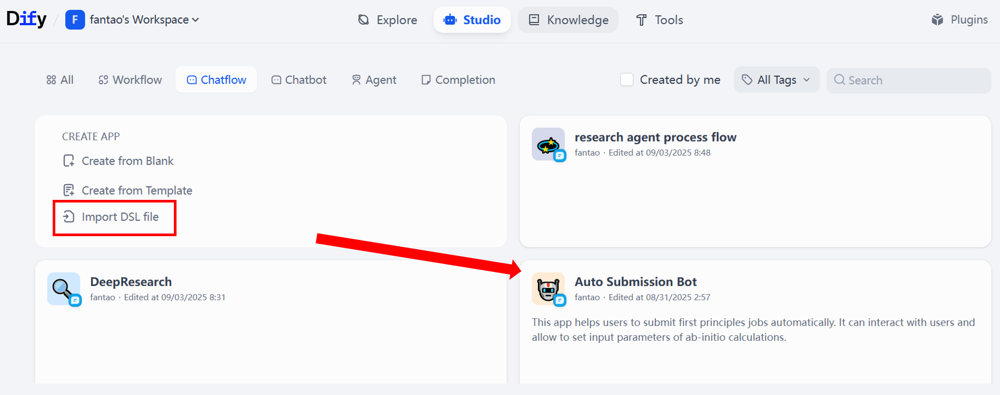

# Auto-Submission-Bot
This app helps users to submit first principles jobs automatically. It can interact with users and allow to set input parameters of ab-initio calculations.

### How to install?
1. The app is built with Dify, please install Dify in your computer first. [Click here for how to install Dify](https://docs.dify.ai/plugin-dev-en/0111-getting-started-dify-plugin)
2. Install Dify plugin **Te_Auto_1**, check README in directory for detail instructions.
3. Import _Auto Submission Bot.yml_ file to your Dify space.
   

### How to use?
