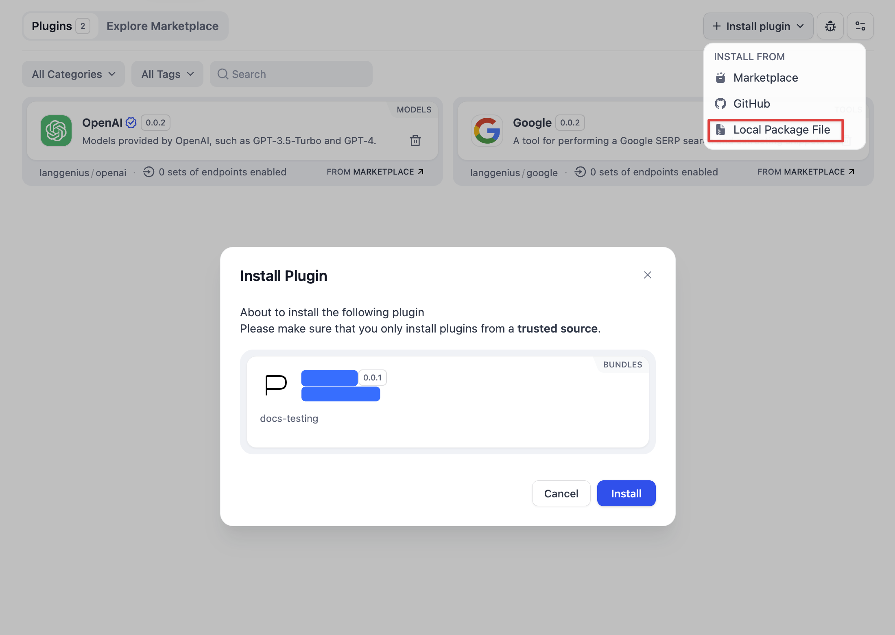

## Te_Auto_1

**Author:** tao_fan
**Version:** 0.0.1
**Type:** tool

### How to install?
Download _te_auto_1.difypkg_ to local place and visit the Dify plugin management page, click **Install Plugin** in the upper right corner → **Local Package File** to install, or drag and drop the plugin file to a blank area of the page to install the plugin.

